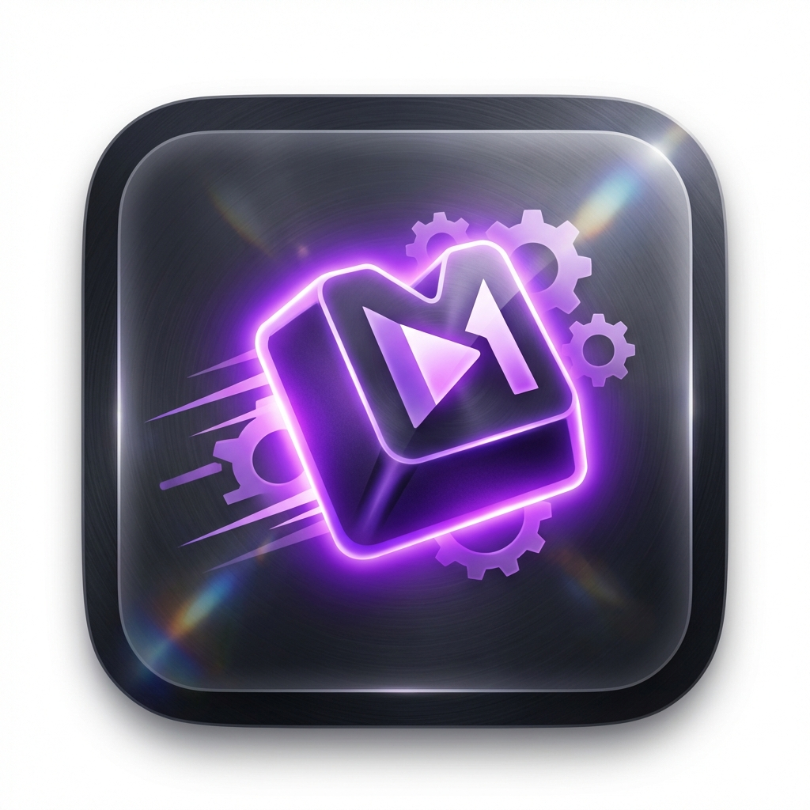

<p align="center">
  
</p>

# Key Presser Macro (키 프레서 매크로)

키보드의 특정 키를 지속적으로 누르고 있거나, 설정한 주기에 맞춰 자동으로 입력해주는 간편한 매크로 프로그램입니다. Electron과 Next.js를 기반으로 제작되었습니다.

## 주요 기능
- **키 입력 모드**:
  - **지속 누름 (HOLD)**: 설정한 키를 'Key Down' 상태로 유지합니다. (시스템 제한으로 인해 매우 짧은 간격의 반복 입력으로 시뮬레이션됩니다.)
  - **주기적 입력 (PERIODIC)**: 설정한 밀리초(ms) 단위 주기마다 키를 자동으로 입력합니다.
- **맞춤형 설정**:
  - 시작/중지(Start/Stop) 단축키를 고성능 셀렉트 박스를 통해 간편하게 설정할 수 있습니다.
  - 매크로를 실행할 대상 키를 자유롭게 지정할 수 있습니다. (알파벳, 숫자, 기능키, 방향키 등 지원)
  - 자동 완성 및 검색 기능이 포함된 **AutoSelect** 컴포넌트로 원하는 키를 빠르게 찾을 수 있습니다.
- **직관적인 GUI**: 다크 모드 테마의 세련된 인터페이스와 실시간 상태 표시등을 제공합니다.

## 프로그램 사용 방법

1.  **대상 키 설정 (Target Key)**:
    - 매크로 동작을 수행할 키를 선택합니다. 검색창에 키 이름을 입력하여 빠르게 찾을 수 있습니다. (예: `Enter`, `F5`, `A`)
2.  **입력 모드 선택 (Input Mode)**:
    - **주기적 입력**: 특정 시간마다 키를 한 번씩 누릅니다.
    - **지속 누름**: 키를 계속 누르고 있는 상태를 시뮬레이션합니다.
3.  **주기 설정 (Interval)**:
    - `PERIODIC` 모드일 경우, 키를 입력할 간격(ms)을 입력합니다. (예: 1000 = 1초)
4.  **단축키 설정 (Start/Stop Shortcut)**:
    - 매크로를 시작하거나 중지할 때 사용할 키를 선택합니다.
    - **주의**: 대상 키와 단축키는 동일하게 설정할 수 없습니다. 충돌 시 경고 메시지가 표시됩니다.
5.  **실행 및 중지**:
    - 프로그램이 실행 중인 상태에서 설정한 **단축키**를 누르면 매크로가 시작됩니다.
    - 매크로가 실행 중일 때는 상단 상태바에 `RUNNING` 표시와 함께 녹색 표시등이 깜빡입니다.
    - 다시 **단축키**를 누르면 매크로가 즉시 중지됩니다.

## 설치 및 실행 방법

이 프로젝트는 `npm` 또는 `yarn`을 사용하여 패키지를 관리합니다.

### 의존성 설치
```bash
npm install
# 또는
yarn install
```

### 개발 모드 실행 (Next.js + Electron)
```bash
npm run dev
# 또는
yarn dev
```

### 실행 파일(.exe) 빌드
프로그램을 단일 실행 파일로 빌드하려면 아래 명령어를 사용합니다. Windows 환경에서는 **관리자 권한으로 실행된 PowerShell** 사용을 권장합니다.
빌드가 완료되면 `dist` 폴더 안에 실행 가능한 `.exe` 파일이 생성됩니다.

#### 권장 빌드 명령어 (PowerShell 관리자 권한)
코드 서명 과정을 건너뛰어 권한 에러를 방지합니다.
```powershell
$env:CSC_SKIP_SIGN="true"; npm run electron:build
```

#### 기본 빌드 명령어
```bash
npm run electron:build
# 또는
yarn electron:build
```

## 기술 스택
- **Framework**: Next.js 16 (Turbopack)
- **Desktop**: Electron
- **Styling**: Vanilla CSS + Tailwind CSS v4 (Separation of Concerns 적용)
- **Language**: TypeScript
