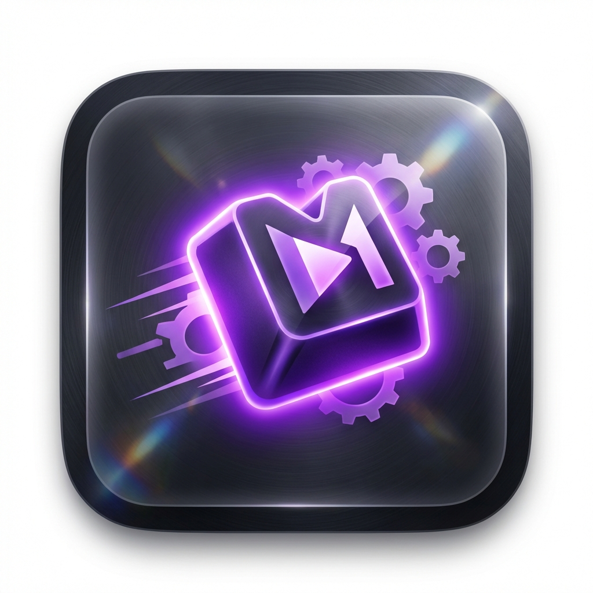
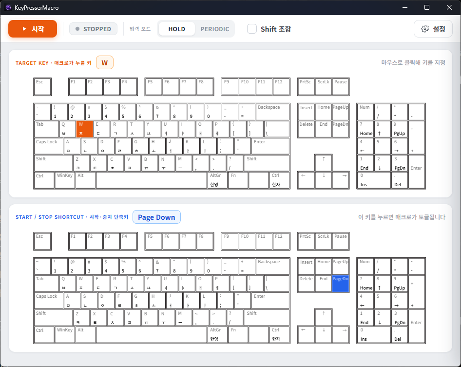

<p align="center">
  
</p>

# Key Presser Macro (키 프레서 매크로)

**Key Presser Macro**는 단순한 반복 입력을 넘어, 게임과 같은 고성능 환경에서도 완벽하게 작동하도록 설계된 데스크탑 매크로 도구입니다. 인터랙티브 키보드 SVG UI와 함께 누구나 쉽게 자신만의 매크로를 설정하고 제어할 수 있습니다.

## 다운로드

> Windows 10 / 11 (x64) 전용 · 설치 불필요 (Portable)

| 버전 | 다운로드 |
|---|---|
| **v2** (최신) | [KeyPresserMacro-v2-portable.exe](https://naver.me/xRgmagoV) |

파일을 내려받아 바로 실행하면 됩니다. Node.js나 별도 런타임 설치는 필요하지 않습니다.

---

### 📸 프로그램 미리보기

**메인 화면**



**지속 누름 실행 중 (게임 화면) — 좌측 상단에 오버레이 창이 표시됩니다**


키보드의 특정 키를 지속적으로 누르고 있거나, 설정한 주기에 맞춰 자동으로 입력해주는 간편한 매크로 프로그램입니다. Electron과 Next.js를 기반으로 제작되었습니다.

## 주요 기능

- **키 입력 모드**:
  - **지속 누름 (HOLD)**: 설정한 키를 'Key Down' 상태로 유지합니다. (시스템 제한으로 인해 매우 짧은 간격의 반복 입력으로 시뮬레이션됩니다.)
  - **주기적 입력 (PERIODIC)**: 설정한 밀리초(ms) 단위 주기마다 키를 자동으로 입력합니다.
- **인터랙티브 키보드 SVG**:
  - 화면에 표시된 키보드 이미지를 직접 클릭해 Target Key와 Start/Stop 단축키를 지정합니다.
  - 선택된 키는 색상으로 구분됩니다. Target Key는 오렌지, 단축키는 파란색으로 하이라이트됩니다.
  - 매크로 실행 중에는 Target Key에 pulse 애니메이션이 적용됩니다.
- **마우스 클릭 지원**: 키보드 키 외에 좌클릭·휠클릭·우클릭도 Target Key로 지정할 수 있습니다. 클릭은 현재 커서 위치에서 발생하며, 마우스 버튼은 시작/중지 단축키로는 사용할 수 없습니다.
- **Shift 조합**: Target Key에 Shift 조합을 활성화할 수 있습니다. (마우스 클릭에도 적용 가능)
- **설정 내보내기 / 불러오기**: 우측 상단 설정 패널에서 현재 매크로 설정을 JSON 파일로 내려받거나 불러올 수 있습니다.
- **직관적인 GUI**: 다크 모드 테마의 세련된 인터페이스와 실시간 상태 표시등을 제공합니다.

## 제한 사항

### 복합 키 미지원

**Target Key는 단일 키만 지원합니다.** `Ctrl+C`, `Alt+F4`, `W+Num8(비행기게임)`와 같은 복합 키(modifier + key | key + key) 조합은 지원되지 않습니다.

유일한 예외는 **Shift 조합**으로, 헤더의 체크박스를 통해 `Shift + Target Key` 형태만 지원됩니다.

> 개발자의 경우: 복합 키 지원이 필요한 경우, 소스 코드를 직접 내려받아 수정하여 자유롭게 사용할 수 있습니다.
> 저장소: https://github.com/1119xkwks/key-presser-macro

---

> [!WARNING]
> **Shift 조합 사용 시 중지 방법**
>
> **HOLD 모드**에서 Shift 조합이 활성화되어 있으면, 매크로가 실행되는 동안 OS 레벨에서 Shift 키가 실제로 눌린 상태로 유지됩니다.
> 이 상태에서는 단순히 단축키만 눌러도 OS가 `Shift + 단축키`로 인식하기 때문에,
> **반드시 `Shift + 단축키`를 함께 눌러야 매크로가 중지됩니다.**
>
> 화면의 **중지 버튼**을 클릭하면 언제든 안전하게 중지할 수 있습니다.

---

## 프로그램 사용 방법

1. **대상 키 설정 (Target Key)**:
   - 상단 `TARGET KEY` 카드의 키보드를 클릭해 매크로가 누를 키를 지정합니다.
   - Shift 조합이 필요한 경우 헤더의 **Shift 조합** 체크박스를 활성화합니다.
2. **입력 모드 선택 (Input Mode)**:
   - **PERIODIC**: 설정한 인터벌(ms)마다 키를 한 번씩 누릅니다.
   - **HOLD**: 키를 계속 누르고 있는 상태를 시뮬레이션합니다.
3. **인터벌 설정**:
   - `PERIODIC` 모드일 경우 헤더의 인터벌 입력란에 주기(ms)를 입력합니다. (예: `1000` = 1초)
4. **단축키 설정 (Start/Stop Shortcut)**:
   - 하단 `START / STOP SHORTCUT` 카드의 키보드를 클릭해 매크로 토글 단축키를 지정합니다.
   - **주의**: Target Key와 단축키는 동일하게 설정할 수 없습니다.
5. **실행 및 중지**:
   - 헤더의 **시작** 버튼을 클릭하거나, 설정한 **단축키**를 누르면 매크로가 시작됩니다.
   - 실행 중에는 상태 뱃지가 `RUNNING`으로 전환되고 Target Key에 pulse 애니메이션이 표시됩니다.
   - **중지** 버튼 또는 단축키를 다시 누르면 즉시 중지됩니다.

## 설치 및 실행 방법 (개발자용)

이 프로젝트는 `npm` 또는 `yarn`을 사용하여 패키지를 관리합니다.

### 의존성 설치
```bash
npm install
# 또는
yarn install
```

### 개발 모드 실행 (Next.js + Electron)
```bash
npm run dev
# 또는
yarn dev
```

### 실행 파일(.exe) 빌드
프로그램을 단일 실행 파일로 빌드하려면 아래 명령어를 사용합니다. Windows 환경에서는 **관리자 권한으로 실행된 PowerShell** 사용을 권장합니다.
빌드가 완료되면 `dist` 폴더 안에 실행 가능한 `.exe` 파일이 생성됩니다.

#### 권장 빌드 명령어 (PowerShell 관리자 권한)
코드 서명 과정을 건너뛰어 권한 에러를 방지합니다.
```powershell
$env:CSC_SKIP_SIGN="true"; npm run electron:build
```

#### 기본 빌드 명령어
```bash
npm run electron:build
# 또는
yarn electron:build
```

## 설정 파일

### 저장 위치

| 환경 | 경로 |
|---|---|
| 실행 파일 (Portable) | `exe 파일과 같은 폴더\key-presser-macro.json` |
| 개발 모드 | 프로젝트 루트 `key-presser-macro.json` |

프로그램 최초 실행 시 설정을 변경하는 순간 자동으로 생성됩니다. 파일을 삭제하면 다음 실행 시 기본값으로 초기화됩니다.

### 저장 시점

설정(Target Key, 단축키, 모드, 인터벌 등)이 변경될 때마다 **자동으로 즉시 저장**됩니다. 별도의 저장 버튼은 없습니다.

내부적으로는 3중 저장 구조를 사용합니다.

| 저장소 | 용도 |
|---|---|
| `key-presser-macro.json` | 영구 저장 (최우선) |
| `localStorage` | 브라우저 캐시 레이어 |
| `cookie` | 브라우저 캐시 폴백 |

### 로드 우선순위

앱 시작 시 `key-presser-macro.json` → `localStorage` → `cookie` → 기본값 순으로 설정을 복원합니다.

### 기본값

| 항목 | 기본값 |
|---|---|
| Target Key | `W` |
| Start/Stop 단축키 | `PageDown` |
| 입력 모드 | `HOLD` |
| 인터벌 | `100ms` |
| Shift 조합 | 비활성 |

---

## 기술 스택
- **Framework**: Next.js 16 (Turbopack)
- **Desktop**: Electron
- **Styling**: Vanilla CSS + Tailwind CSS v4 (Separation of Concerns 적용)
- **Language**: TypeScript
- **Toast 알림**: Sonner

## 개발 방식

이 프로젝트는 **바이브 코딩(Vibe Coding)** 방식으로 제작되었습니다.

- **[Claude Code](https://claude.ai/code)** — 코드 구현 및 리팩터링
- **[Claude Design](https://claude.ai/design)** — v2 UI 디자인 시안 제작 및 Export

### 프로젝트 가이드 파일

Claude Code와의 협업 규칙 및 스킬 정의는 아래 파일에 명세되어 있습니다.

| 파일 | 설명 |
|---|---|
| [`CLAUDE.md`](./CLAUDE.md) | 언어, 스타일링, 에셋, 디자인 원칙 등 프로젝트 전반의 규칙 |
| [`.claude/feature/SKILLS.md`](./.claude/feature/SKILLS.md) | 기능 구현 관련 스킬 정의 |
| [`.claude/tailwind-css/SKILLS.md`](./.claude/tailwind-css/SKILLS.md) | Tailwind CSS 관련 스킬 정의 |

## 참고 자료

| 자료 | 출처 |
|---|---|
| 키보드 SVG 레이아웃 (`docs/inline_svgs/keyboard-mappings-outline.svg`) | [FreeSVG — Full PC Keyboard Template for Defining Key Mappings](https://freesvg.org/vector-image-of-full-pc-keyboard-template-for-defining-key-mappings) |
